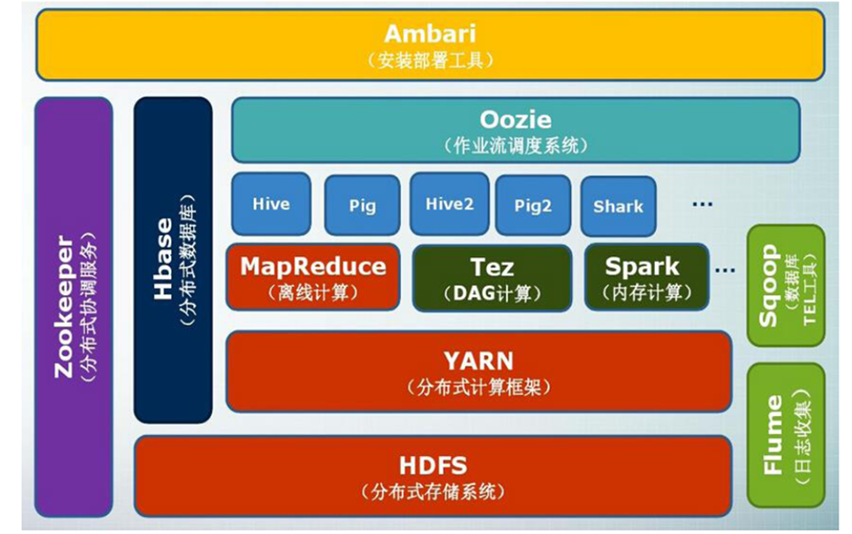

# Task01 详读第1、2章Hadoop内容

## 第一章 大数据概述

### 1 大数据的三次浪潮

| 信息化浪潮 | 时间 | 标志 | 解决的问题 |
| :---: | :---: | :---: | :---: |
| 第一次浪潮 | 1980 | 个人计算机 | 信息处理 |
| 第二次浪潮 | 1995 | 互联网 | 信息传输 |
| 第三次浪潮 | 2010 | 物联网、云计算和大数据 | 信息爆炸 |

### 2 大数据的4个“V"
1. 数据量大（Volume）
2. 数据类型繁多（Variety）
3. 处理速度快（ Velocity）
4. 价值密度低（Value）


### 3 大数据关键技术

- 数据采集
    1. 爬虫
    2. 日志记录
- 数据存储和管理
    1. 关系数据库
    2. 数据仓库
    3. 数据仓库技术（ETL）
- 数据处理与分析
    1. 联机分析处理（OLAP）
    2. 数据挖掘
    3. 数据可视化
- 数据安全和隐私保护


## 第二章 Hadoop

### 1 Hadoop简介
&emsp;&emsp;**Hadoop是Apache软件基金会旗下的一个开源分布式计算平台，为用户提供了系统底层细节透明的分布式基础架构。**Hadoop是基于**Java**语言开发的，具有很好的**跨平台特性**，并且可以**部署在廉价的计算机集群**中。  
&emsp;&emsp;Hadoop的核心是**分布式文件系统HDFS**（Hadoop Distributed File System）和 **MapReduce**。HDFS是对谷歌文件系统(Google File System，GFS）的开源实现，是面向普通硬件环境的分布式文件系统，具有较高的读写速度、很好的容错性和可伸缩性，支持大规模数据的分布式存储，其冗余数据存储的方式，很好地保证了数据的安全性。MapReduce是针对谷歌MapReduce的开源实现，允许用户在不了解分布式系统底层细节的情况下开发并行应用程序，采用MapReduce来整合分布式文件系统上的数据，可保证分析和处理数据的高效性。借助于Hadoop，程序员可以轻松地编写分布式并行程序，可将其运行于廉价计算机集群上，完成海量数据的存储与计算。  
&emsp;&emsp;Hadoop被公认为行业大数据标准开源软件，在分布式环境下提供了海量数据的处理能力。几乎所有主流厂商都围绕Hadoop提供开发工具、开源软件、商业化工具和技术服务，如谷歌、雅虎、微软、思科和淘宝等都支持Hadoop。  

### 2 Hadoop特性
- **高可靠性：** 采用冗余数据存储方式，即使一个副本发生故障，其他副本也可以保证正常对外提供服务。Hadoop按位存储和处理数据的能力，值得人们信赖。
- **高效性：** 作为并行分布式计算平台，Hadoop采用分布式存储和分布式处理两大核心技术，能够高效地处理PB级数据。Hadoop能够在节点之间动态地移动数据，并保证各个节点的动态平衡，因此处理速度非常快。
- **高可扩展性：** Hadoop的设计目标是可以高效稳定地运行在廉价的计算机集群上，可以扩展到数以千计的计算机节点。
- **高容错性：** 采用冗余数据存储方式，自动保存数据的多个副本，并且能够自动将失败的任务进行重新分配。
- **成本低：** Hadoop采用廉价的计算机集群，成本较低，普通用户也很容易用自己的PC上搭建Hadoop运行环境。与一体机、商用数据仓库以及QlikView、Yonghong Z-Suite等数据集市相比，Hadoop是开源的，项目的软件成本因此会大大降低。
- **运行在Linux平台上：** Hadoop是基于Java语言开发的，可以较好地运行在Linux平台上。
- **支持多种编程语言：** Hadoop上的应用程序也可以使用其他语言编写，如C++。

### 3 Hadoop的项目架构



### 4 Hadoop集群安装
由于我用的是Mac系统M1芯片，并且是arm架构的，所以采用了Docker进行Hadoop集群的搭建。之前有自己搭建过Hadoop集群，在这里附上地址：https://github.com/Weihong-Liu/hadoop-docker/tree/main/hadoop-docker-aarch64

#### 4.1 Hadoop配置文件编写
创建hadoop配置文件夹
```bash
mkdir -p config/hadoop-config
```

在config/hadoop-config新建core-site.xml文件
```xml
<?xml version="1.0"?>
<configuration>
    <property>
        <name>fs.defaultFS</name>
        <value>hdfs://hadoop-master:9000/</value>
    </property>
    <property>
        <name>io.file.buffer.size</name>
        <value>131072</value>
    </property>

    <property>
        <name>hadoop.tmp.dir</name>
        <value>/usr/local/hadoop/hadoop/tmp</value>
    </property>
</configuration>
```
在config/hadoop-config新建hdfs-site.xml文件
```xml
<?xml version="1.0"?>
<configuration>
    <property>
        <name>dfs.namenode.name.dir</name>
        <value>file:/root/hdfs/namenode</value>
        <description>NameNode directory for namespace and transaction logs storage.</description>
    </property>
    <property>
        <name>dfs.datanode.data.dir</name>
        <value>file:/root/hdfs/datanode</value>
        <description>DataNode directory</description>
    </property>
    <property>
        <name>dfs.replication</name>
        <value>3</value>
    </property>
</configuration>
```
在config/hadoop-config新建yarn-site.xml文件
```xml
<?xml version="1.0"?>
<configuration>
    <!-- Site specific YARN configuration properties -->
    <!--指定resourcemanager所启动的服务器主机名-->
    <property>
        <name>yarn.resourcemanager.hostname</name>
        <value>hadoop-slave2</value>
    </property>
    <!--指定mapreduce的shuffle-->
    <property>
        <name>yarn.nodemanager.aux-services</name>
        <value>mapreduce_shuffle</value>
    </property>
    <!--指定resourcemanager的内部通讯地址-->
    <property>
        <name>yarn.resourcemanager.address</name>
        <value>hadoop-slave2:8032</value>
    </property>
    <!--指定scheduler的内部通讯地址-->
    <property>
        <name>yarn.resourcemanager.scheduler.address</name>
        <value>hadoop-slave2:8030</value>
    </property>
    <!--指定resource-tracker的内部通讯地址-->
    <property>
        <name>yarn.resourcemanager.resource-tracker.address</name>
        <value>hadoop-slave2:8031</value>
    </property>
    <!--指定resourcemanager.admin的内部通讯地址-->
    <property>
        <name>yarn.resourcemanager.admin.address</name>
        <value>hadoop-slave2:8033</value>
    </property>
    <!--指定resourcemanager.webapp的ui监控地址-->
    <property>
        <name>yarn.resourcemanager.webapp.address</name>
        <value>hadoop-slave2:8088</value>
    </property>
    <property>
        <name>yarn.nodemanager.resource.memory-mb</name>
        <value>2048</value>
    </property>
    <property>
        <name>yarn.nodemanager.env-whitelist</name>
        <value>JAVA_HOME,HADOOP_COMMON_HOME,HADOOP_HDFS_HOME,HADOOP_CONF_DIR,CLASSPATH_PREPEND_DISTCACHE,HADOOP_YARN_HOME,HADOOP_HOME</value>
    </property>
</configuration>
```
在config/hadoop-config新建mapred-site.xml文件
```xml
<?xml version="1.0"?>
<configuration>
    <property>
        <name>mapreduce.framework.name</name>
        <value>yarn</value>
    </property>
    <property>
        <name>mapreduce.jobhistory.address</name>
        <value>hadoop-master:10020</value>
    </property>

    <property>
        <name>mapreduce.jobhistory.web.address</name>
        <value>hadoop-master:19888</value>
    </property>
    <property>
        <name>mapreduce.application.classpath</name>
        <value>$HADOOP_HOME/share/hadoop/mapreduce/*:$HADOOP_HOME/share/hadoop/mapreduce/lib/*</value>
    </property>
</configuration>
```

在config/hadoop-config新建workers文件
```
hadoop-master
hadoop-slave1
hadoop-slave2
```
从hadoop3.3.1中找到hadoop-env.sh 第55行添加以下内容，并且复制到config/hadoop-config中
```bash
export JAVA_HOME=/usr/local/hadoop/jdk1.8
export HDFS_NAMENODE_USER=root
export HDFS_DATANODE_USER=root
export HDFS_SECONDARYNAMENODE_USER=root
export YARN_RESOURCEMANAGER_USER=root
export YARN_NODEMANAGER_USER=root
```

#### 4.2 资源文件下载
[hadoop-3.3.1-aarch64](https://dlcdn.apache.org/hadoop/common/hadoop-3.3.1/hadoop-3.3.1-aarch64.tar.gz) and [JDK1.8-aarch64](https://gitee.com/Bric666/java/attach_files/803375/download/jdk-8u301-linux-aarch64.tar.gz) and [scala-2.12.14](https://downloads.lightbend.com/scala/2.12.14/scala-2.12.14.tgz) and [spark-3.2.1-bin-hadoop3.2](https://dlcdn.apache.org/spark/spark-3.2.1/spark-3.2.1-bin-hadoop3.2.tgz)

将下载得到的`hadoop-3.3.1-aarch64.tar.gz`、`jdk-8u301-linux-aarch64.tar.gz`、`scala-2.12.14.tgz`和`spark-3.2.1-bin-hadoop3.2.tgz`文件放入`resources`文件夹中

#### 4.3 Shell脚本编写
一键启动或停止Hadoop脚本
```bash
vim config/myhadoop.sh
```
写入以下内容
```bash
#!/bin/bash

if [ $# -lt 1 ]
then
    echo "No Args Input..."
    exit ;
fi

case $1 in
"start")
        echo " =================== 启动 hadoop集群 ==================="
        echo " --------------- 启动 hdfs ---------------"
        ssh hadoop-master "/usr/local/hadoop/hadoop/sbin/start-dfs.sh"
        echo " --------------- 启动 yarn ---------------"
        ssh hadoop-slave2 "/usr/local/hadoop/hadoop/sbin/start-yarn.sh"
#        echo " --------------- 启动 historyserver ---------------"
#       ssh hadoop-master "/usr/local/hadoop/hadoop/bin/mapred --daemon start historyserver"
;;
"stop")
        echo " =================== 关闭 hadoop集群 ==================="

#      echo " --------------- 关闭 historyserver ---------------"
#      ssh hadoop-master "/usr/local/hadoop/hadoop/bin/mapred --daemon stop historyserver"
        echo " --------------- 关闭 yarn ---------------"
        ssh hadoop-slave2 "/usr/local/hadoop/hadoop/sbin/stop-yarn.sh"
        echo " --------------- 关闭 hdfs ---------------"
        ssh hadoop-master "/usr/local/hadoop/hadoop/sbin/stop-dfs.sh"
;;
*)
    echo "Input Args Error..."
;;
esac
```

词频统计脚本
```bash
vim config/run-wordcount.sh
```
写入一下内容
```bash
#!/bin/bash

# test the hadoop cluster by running wordcount

# create input files 
mkdir input
echo "Hello Docker" >input/file2.txt
echo "Hello Hadoop" >input/file1.txt

# create input directory on HDFS
hadoop fs -mkdir -p input

# put input files to HDFS
hdfs dfs -put ./input/* input

# run wordcount 
hadoop jar $HADOOP_HOME/share/hadoop/mapreduce/sources/hadoop-mapreduce-examples-$1-sources.jar org.apache.hadoop.examples.WordCount input output

# print the input files
echo -e "\ninput file1.txt:"
hdfs dfs -cat input/file1.txt

echo -e "\ninput file2.txt:"
hdfs dfs -cat input/file2.txt

# print the output of wordcount
echo -e "\nwordcount output:"
hdfs dfs -cat output/part-r-00000
```

### 4.4 docker系统内部配置
profile
```bash
vim config/profile
```
写入以下内容
```
for item in `cat /proc/1/environ |tr '\0' '\n'`
do
 export $item
done
```
ssh_config
```bash
vim config/ssh_config
```
写入以下内容
```
Host localhost
  StrictHostKeyChecking no

Host 0.0.0.0
  StrictHostKeyChecking no
  
Host hadoop-*
   StrictHostKeyChecking no
   UserKnownHostsFile=/dev/null

LogLevel=quiet
```

### 4.5 Dockerfile文件
```bash
vim Dockerfile
```
写入以下内容
```
FROM ubuntu:20.04

LABEL maintainer="puppets"

WORKDIR /root

# 换源
# RUN echo "nameserver 8.8.8.8" >> /etc/resolv.conf
# mirrors.aliyun.com
RUN  sed -i s@/ports.ubuntu.com/@/mirrors.ustc.edu.cn/@g /etc/apt/sources.list
RUN apt-get clean all
RUN apt-get update

# install 
RUN apt-get autoremove openssh-client openssh-server
RUN apt-get  install -y openssh-client openssh-server wget vim net-tools 
RUN apt install -y iputils-ping

ADD resources/hadoop-3.3.1-aarch64.tar.gz /usr/local/hadoop
ADD resources/jdk-8u301-linux-aarch64.tar.gz /usr/local/hadoop
ADD resources/scala-2.12.14.tgz /usr/local/hadoop
ADD resources/spark-3.2.1-bin-hadoop3.2.tgz /usr/local/hadoop

RUN mv /usr/local/hadoop/hadoop-* /usr/local/hadoop/hadoop && \
    mv /usr/local/hadoop/jdk* /usr/local/hadoop/jdk1.8 && \
    mv /usr/local/hadoop/scala* /usr/local/hadoop/scala2.12 && \
    mv /usr/local/hadoop/spark* /usr/local/hadoop/spark3.2.1

# set environment variable
ENV JAVA_HOME=/usr/local/hadoop/jdk1.8
ENV JRE_HOME=$JAVA_HOME/jre
ENV CLASSPATH=.:$CLASSPATH:$JAVA_HOME/lib:$JRE_HOME/lib
ENV PATH=$PATH:$JAVA_HOME/bin:$JRE_HOME/bin

ENV HADOOP_HOME=/usr/local/hadoop/hadoop
ENV PATH=$PATH:$HADOOP_HOME/bin:$HADOOP_HOME/sbin 

ENV SCALA_HOME=/usr/local/hadoop/scala2.12
ENV PATH=$PATH:$SCALA_HOME/bin:$HADOOP_HOME/sbin 

ENV SPARK_HOME=/usr/local/hadoop/spark3.2.1
ENV PATH=$PATH:$SPARK_HOME/bin:$HADOOP_HOME/sbin 

# ssh without key
RUN ssh-keygen -t rsa -f ~/.ssh/id_rsa -P '' && \
    cat ~/.ssh/id_rsa.pub >> ~/.ssh/authorized_keys

RUN mkdir -p ~/hdfs/namenode && \ 
    mkdir -p ~/hdfs/datanode && \
    mkdir $HADOOP_HOME/logs && \
    mkdir $HADOOP_HOME/tmp

COPY config/* /tmp/

RUN mv /tmp/ssh_config ~/.ssh/config && \
    mv /tmp/hadoop-config/hadoop-env.sh $HADOOP_HOME/etc/hadoop/hadoop-env.sh && \
    mv /tmp/hadoop-config/hdfs-site.xml $HADOOP_HOME/etc/hadoop/hdfs-site.xml && \ 
    mv /tmp/hadoop-config/core-site.xml $HADOOP_HOME/etc/hadoop/core-site.xml && \
    mv /tmp/hadoop-config/mapred-site.xml $HADOOP_HOME/etc/hadoop/mapred-site.xml && \
    mv /tmp/hadoop-config/yarn-site.xml $HADOOP_HOME/etc/hadoop/yarn-site.xml && \
    mv /tmp/hadoop-config/workers $HADOOP_HOME/etc/hadoop/workers && \
    mv /tmp/start-hadoop.sh ~/start-hadoop.sh && \
    mv /tmp/stop-hadoop.sh ~/stop-hadoop.sh && \
    mv /tmp/run-wordcount.sh ~/run-wordcount.sh

RUN chmod +x ~/start-hadoop.sh && \
    chmod +x ~/stop-hadoop.sh && \
    chmod +x ~/run-wordcount.sh && \
    chmod +x $HADOOP_HOME/sbin/start-dfs.sh && \
    chmod +x $HADOOP_HOME/sbin/start-yarn.sh 

RUN sed -i 1a\HDFS_DATANODE_USER=root $HADOOP_HOME/sbin/start-dfs.sh && \
    sed -i 2a\HDFS_NAMENODE_USER=root $HADOOP_HOME/sbin/start-dfs.sh && \
    sed -i 3a\HDFS_SECONDARYNAMENODE_USER=root $HADOOP_HOME/sbin/start-dfs.sh && \
    sed -i 4a\YARN_RESOURCEMANAGER_USER=root $HADOOP_HOME/sbin/start-dfs.sh && \
    sed -i 5a\YARN_NODEMANAGER_USER=root $HADOOP_HOME/sbin/start-dfs.sh && \
    sed -i 1a\HDFS_DATANODE_USER=root $HADOOP_HOME/sbin/stop-dfs.sh && \
    sed -i 2a\HDFS_NAMENODE_USER=root $HADOOP_HOME/sbin/stop-dfs.sh && \
    sed -i 3a\HDFS_SECONDARYNAMENODE_USER=root $HADOOP_HOME/sbin/stop-dfs.sh && \
    sed -i 4a\YARN_RESOURCEMANAGER_USER=root $HADOOP_HOME/sbin/stop-dfs.sh && \
    sed -i 5a\YARN_NODEMANAGER_USER=root $HADOOP_HOME/sbin/stop-dfs.sh && \
    sed -i 1a\YARN_RESOURCEMANAGER_USER=root $HADOOP_HOME/sbin/start-yarn.sh && \
    sed -i 2a\HADOOP_SECURE_DN_USER=yarn $HADOOP_HOME/sbin/start-yarn.sh && \
    sed -i 3a\YARN_NODEMANAGER_USER=root $HADOOP_HOME/sbin/start-yarn.sh && \
    sed -i 1a\YARN_RESOURCEMANAGER_USER=root $HADOOP_HOME/sbin/stop-yarn.sh && \
    sed -i 2a\HADOOP_SECURE_DN_USER=yarn $HADOOP_HOME/sbin/stop-yarn.sh && \
    sed -i 3a\YARN_NODEMANAGER_USER=root $HADOOP_HOME/sbin/stop-yarn.sh

RUN cat /tmp/profile >> /etc/profile && \
    rm -rf $HADOOP_HOME/share/doc

# format namenode
RUN $HADOOP_HOME/bin/hdfs namenode -format

CMD [ "sh", "-c", "service ssh start; bash"]
```

### 4.6 构建docker镜像Shell脚本
```bash
vim build-image.sh
```
写入以下内容
```bash
#!/bin/bash

echo -e "\nbuild docker hadoop image\n"
sudo docker build -f Dockerfile -t puppets/hadoop:1.0 .

echo ""
```

### 4.7 启动docker容器Shell脚本
```bash
vim start-container.sh
```
写入以下内容
```bash
#!/bin/bash

# the default node number is 3
N=${1:-3}


# start hadoop hadoop-master container
sudo docker rm -f hadoop-master &> /dev/null
echo "start hadoop-master container..."
sudo docker run -itd \
                --net=hadoop \
                -p 9870:9870 \
                -p 8088:8088 \
				-p 4040:4040 \
                --name hadoop-master \
                --hostname hadoop-master \
                puppets/hadoop:1.0 &> /dev/null


# start hadoop slave container
i=1
while [ $i -lt $N ]
do
	sudo docker rm -f hadoop-slave$i &> /dev/null
	echo "start hadoop-slave$i container..."
	sudo docker run -itd \
					--net=hadoop \
					--name hadoop-slave$i \
					--hostname hadoop-slave$i \
					puppets/hadoop:1.0 &> /dev/null
	i=$(( $i + 1 ))
done 

# get into hadoop master container
sudo docker exec -it hadoop-master bash
```

### 4.8 Hadoop集群构建
1. 构建docker镜像
```bash
bash build-image.sh
```
2. 启动容器
```bash
bash start-container.sh
```
启动容器后，会进入master容器中

3. 进入master容器后，启动Hadoop集群
```bash
bash myhadoop.sh start
```
4. 使用`jps`命令查看进程
- master节点
    ```
    176 NameNode
    801 Jps
    339 DataNode
    678 NodeManager
    521 SecondaryNameNode
    ```
- slave1节点（在master节点中执行`ssh hadoop-slave1`，即可进入slave1节点中）
    ```
    337 Jps
    70 DataNode
    185 NodeManager
    ```
- slave2节点（在master节点中执行`ssh hadoop-slave2`，即可进入slave2节点中）
    ```
    243 ResourceManager
    70 DataNode
    551 NodeManager
    748 Jps
    ```

由于使用的是docker容器，如果把SecondaryNameNode、NameNode、ResourceManager都放在master节点上，会比较容易挂掉，于是我在配置文件中，将ResourceManager放在了slave2节点上

5. wordcount词频统计
```bash 
./run-wordcount.sh 3.3.1 #3.3.1为Hadoop对应版本号
```
执行结果如下：

```
2023-02-12 07:11:04,331 INFO client.DefaultNoHARMFailoverProxyProvider: Connecting to ResourceManager at hadoop-slave2/172.19.0.5:8032
2023-02-12 07:11:04,571 INFO mapreduce.JobResourceUploader: Disabling Erasure Coding for path: /tmp/hadoop-yarn/staging/root/.staging/job_1676185054018_0001
2023-02-12 07:11:04,715 INFO input.FileInputFormat: Total input files to process : 2
2023-02-12 07:11:04,756 INFO mapreduce.JobSubmitter: number of splits:2
2023-02-12 07:11:04,851 INFO mapreduce.JobSubmitter: Submitting tokens for job: job_1676185054018_0001
2023-02-12 07:11:04,851 INFO mapreduce.JobSubmitter: Executing with tokens: []
2023-02-12 07:11:04,948 INFO conf.Configuration: resource-types.xml not found
2023-02-12 07:11:04,948 INFO resource.ResourceUtils: Unable to find 'resource-types.xml'.
2023-02-12 07:11:05,143 INFO impl.YarnClientImpl: Submitted application application_1676185054018_0001
2023-02-12 07:11:05,173 INFO mapreduce.Job: The url to track the job: http://hadoop-slave2:8088/proxy/application_1676185054018_0001/
2023-02-12 07:11:05,173 INFO mapreduce.Job: Running job: job_1676185054018_0001
2023-02-12 07:11:10,263 INFO mapreduce.Job: Job job_1676185054018_0001 running in uber mode : false
2023-02-12 07:11:10,265 INFO mapreduce.Job:  map 0% reduce 0%
2023-02-12 07:11:14,341 INFO mapreduce.Job:  map 100% reduce 0%
2023-02-12 07:11:19,387 INFO mapreduce.Job:  map 100% reduce 100%
2023-02-12 07:11:20,424 INFO mapreduce.Job: Job job_1676185054018_0001 completed successfully
2023-02-12 07:11:20,505 INFO mapreduce.Job: Counters: 54
	File System Counters
		FILE: Number of bytes read=56
		FILE: Number of bytes written=819273
		FILE: Number of read operations=0
		FILE: Number of large read operations=0
		FILE: Number of write operations=0
		HDFS: Number of bytes read=258
		HDFS: Number of bytes written=26
		HDFS: Number of read operations=11
		HDFS: Number of large read operations=0
		HDFS: Number of write operations=2
		HDFS: Number of bytes read erasure-coded=0
	Job Counters 
		Launched map tasks=2
		Launched reduce tasks=1
		Data-local map tasks=2
		Total time spent by all maps in occupied slots (ms)=4035
		Total time spent by all reduces in occupied slots (ms)=2619
		Total time spent by all map tasks (ms)=4035
		Total time spent by all reduce tasks (ms)=2619
		Total vcore-milliseconds taken by all map tasks=4035
		Total vcore-milliseconds taken by all reduce tasks=2619
		Total megabyte-milliseconds taken by all map tasks=4131840
		Total megabyte-milliseconds taken by all reduce tasks=2681856
	Map-Reduce Framework
		Map input records=2
		Map output records=4
		Map output bytes=42
		Map output materialized bytes=62
		Input split bytes=232
		Combine input records=4
		Combine output records=4
		Reduce input groups=3
		Reduce shuffle bytes=62
		Reduce input records=4
		Reduce output records=3
		Spilled Records=8
		Shuffled Maps =2
		Failed Shuffles=0
		Merged Map outputs=2
		GC time elapsed (ms)=122
		CPU time spent (ms)=930
		Physical memory (bytes) snapshot=853270528
		Virtual memory (bytes) snapshot=7500697600
		Total committed heap usage (bytes)=764936192
		Peak Map Physical memory (bytes)=323678208
		Peak Map Virtual memory (bytes)=2495873024
		Peak Reduce Physical memory (bytes)=240848896
		Peak Reduce Virtual memory (bytes)=2509676544
	Shuffle Errors
		BAD_ID=0
		CONNECTION=0
		IO_ERROR=0
		WRONG_LENGTH=0
		WRONG_MAP=0
		WRONG_REDUCE=0
	File Input Format Counters 
		Bytes Read=26
	File Output Format Counters 
		Bytes Written=26
input file1.txt:
Hello Hadoop
input file2.txt:
Hello Docker
wordcount output:
Docker	1
Hadoop	1
Hello	2
```

3. 停止Hadoop集群
```bash
bash myhadoop.sh stop
```

到此，集群安装完成。

## 5 任务小结

本次任务，主要介绍了大数据和Hadoop的相关概念，以及Hadoop集群安装，包括以下内容：

1. 大数据三次浪潮
2. 大数据4V特征
3. Hadoop与Google的关系
4. Hadoop分布式集群安装