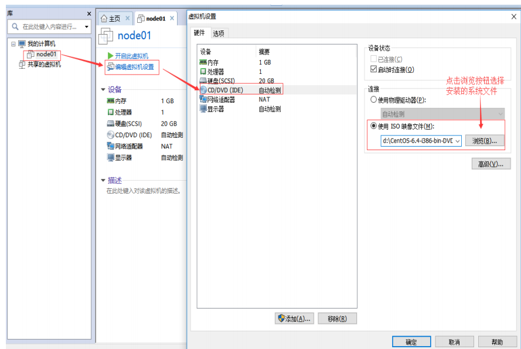
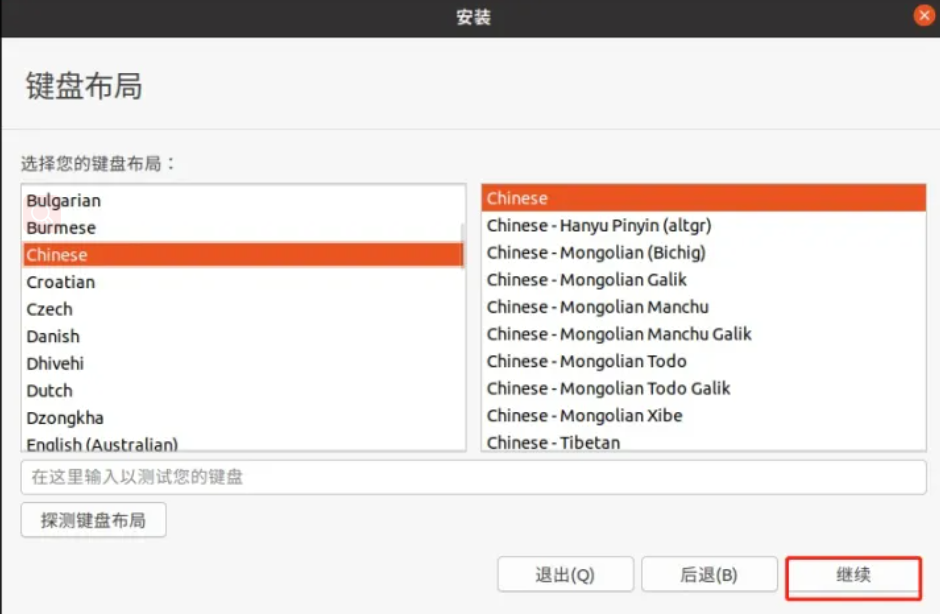
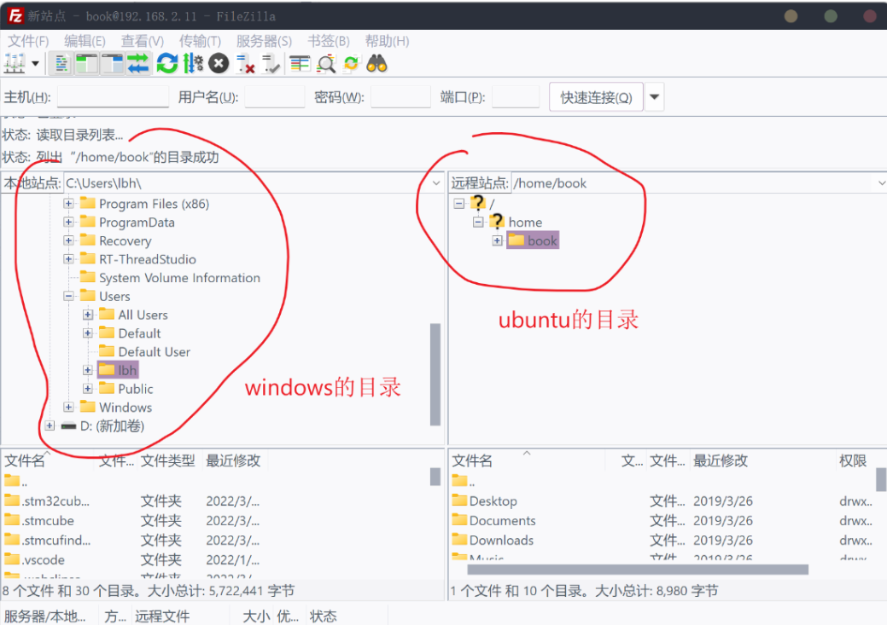
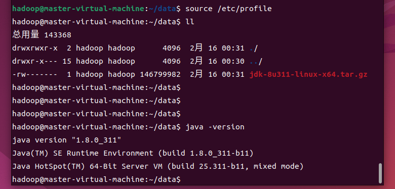
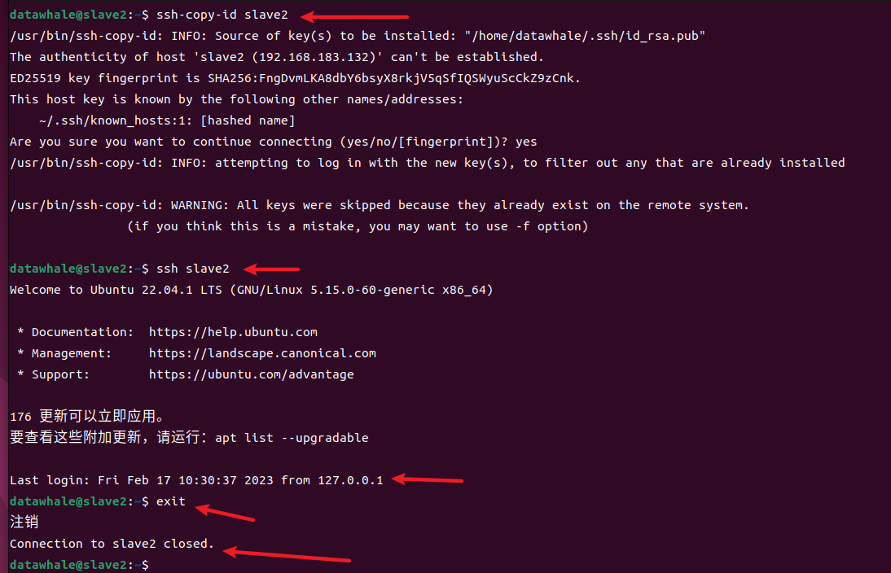

# Task01

## 实验：完全分布式集群

集群架构规划：1个主要节点（master）+2个从节点（slave1与 slave2）

搭建环境：window10 + VMware pro12.0 + ubuntu-22.04.1-desktop-amd64 + hadoop-3.3.1

### 一 、主节点：master

#### 1 为master节点安装操作系统

✅参考教程：[2020最新版VMware安装Ubuntu20.04教程(巨细)！](https://zhuanlan.zhihu.com/p/141033713)

##### 1.1 新建虚拟机

###### 1.1.1 新建虚拟机

在启动页面的右侧显示创建新的虚拟机快捷键，或启动页面的工具栏“文件”选项目录下选择新建虚拟机，两种方式都可以。


###### 1.1.2 选择自定义安装，点击下一步


###### 1.1.3 虚拟机硬件兼容性选择窗口，不需要操作，继续点击下一步


###### 1.1.4 给虚拟机安装操作系统

有三个选项，分别是 1）使用光驱从系统光盘安装；2）从系统光盘映像文件自动安装（iso 文件），缺点是无法进行个性化设置；3）先创建虚拟机，跳过系统安装，稍后手动安装。*<u>在这里选择第 3 个选项，先不安装操作系统，稍后手动安装，点击下一步按钮。</u>*


###### 1.1.5 选择稍后手动安装的操作系统类型和版本


###### 1.1.6 设置虚拟机名称和虚拟机文件存储位置

图片所改地址为我电脑本地所存放位置，可根据自己实际情况进行设置


###### 1.1.7 虚拟机资源配置

处理器配置都是虚拟出来的，按照默认配置就可以。如果机器性能强也可以根据需求自定义选择。滑动下图中左侧的滑块和右侧的上下调节按键都可以设置内存大小。


###### 1.1.8 设置虚拟机网络类型


###### 1.1.9 接下来的配置按照推荐默认的配置一直点下一步完成


###### 1.1.10 虚拟机配置

<mark>注意</mark>：指定磁盘容量中，千万**不要**将“立即分配所有磁盘空间”勾选上，否则会在硬盘上立即划分出一个固定的空间给虚拟机使用，如果不勾选会根据需要自动调节，最大上限是设置的值。


###### 1.1.11 设置虚拟机磁盘文件路径和名称

使用推荐默认选项即可，继续点下一步。


###### 1.1.12 创建完成

详细列出虚拟机的配置信息，点击完成。


接下来删除一些我们不需要的配置，点击编辑虚拟机设置


在虚拟机设备详情界面中选择 ***USB 控制器、声卡、打印机*** 分别点击移除按钮将这三项没用的设备删除。


##### 1.2 在虚拟机中安装ubuntu操作系统

###### 1.2.1 添加系统镜像文件路径

提前下载好系统镜像文件ubuntu-22.04.1-desktop-amd64.iso

在 vmware 最左侧虚拟机机器列表中，选择需要安装系统的虚拟机，点击“编辑虚拟机设置”按钮，在弹出的虚拟机设备列表中选中 CD/DVD(IDE)，选中“使用 ISO 映像文件”，点击“浏览”按钮添加系统映像文件路径，点击确定按钮。



###### 1.2.2 安装系统镜像

点击 “开启此虚拟机” 按钮


###### 1.2.3 系统安装过程

1. 等待其自行加载ubuntu

2. 选择简体中文并且安装ubuntu

3. .选择chinese点击继续 

4. 选择正常安装之后点击继续 

5. 点击安装 

6. 点击继续进行下一步 

7. 个人信息填写完毕之后继续点击下一步(此处的用户名建立登录账号，是具有sudo权限) 

8. 等待ubuntu的自行安装即可,安装完成之后重启虚拟机 )

9. 点击账户输入密码进行登录 

10. 安装完成之后发现虚拟机未能全屏显示，解决方案参考笔记**前面列出的安装教程**，找到VMware tools进行安装，因本次安装未遇到不能全屏显示，故不加入该部分内容。

#### 2 使用 FileZilla 工具建立windows本地主机与master节点互传

FileZilla是一款免费的工具，是基于 FTP 协议进行文件互传的，在传输过程中我们的ubuntu是作为服务器， FileZilla 工具则是作为客户端

##### 2.1 在master系统ubuntu安装 FTP服务

1. 在ubuntu终端下输入如下命令

```shell
sudo apt-get install vsftpd
```


2. 安装完之后检查 /etc/vsftpd.conf 配置文件，输入如下命令打开配置文件：

```shell
sudo vi  /etc/vsftpd.conf
```

3. 然后检查下图 28 和 31 行的内容是否有被注释掉，如果前面有 “#” 号注释起来的话，就去掉即可。 


4. 修改完之后，重启FTP服务，如下命令：
   
   ```shell
   sudo /etc/init.d/vsftpd restart
   ```

##### 2.2 windows安装和配置FileZilla

✅参考教程：[windows主机和ubuntu互传文件的4种方法](https://zhuanlan.zhihu.com/p/141033713)

1. **FileZilla 客户端下载和安装**
   
   F ileZilla工具可以去官网下载即可，[下载 - FileZilla官网](https://www.filezilla.cn/download)。要安装的是客户端，选择对应版本的客户端下载，然后一路 next 安装即可。

2. **FileZilla 软件配置和连接ubuntu**
   
   打开 FileZilla 软件，然后选择：文件 -> 站点管理器 -> 点击新增站点，然后配置连接参数，如下图： 
   
   点击连接之后，就可以看到ubuntu下的文件了，如下图： 

3. **filezilla里解决中文乱码问题**
   
   
   
   filezilla连接上站点后，点击菜单栏的“文件”选项，下拉选择“添加当前连接到站点管理器”。
   
   在弹出的“站点管理器”窗口中，左侧选择 “新站点”，右侧切换到 “字符集” 选项卡后，勾选“使用自定义的字符集 ”并将编码设置为 “gb2312” ，或者选择 ”强制UTF-8″ ，两者编码选择其一，就能解决乱码问题。
   
   

4. 预先把 java安装包与Hadoop安装包通过filezilla上传到master
   
   登录hadoop用户，预先把 java安装包与Hadoop安装包从windows本地拖拽上传到master节点系统中hadoop用户下的data文件夹
   
   

#### 3 为master节点创建Hadoop用户

为方便操作，我们创建一个名为 <font color="orange">datawhale</font> 的用户来运行程序，这样可以使不同用户之间有明确的权限区别。同时，也可以防止Hadoop的配置操作影响到其他用户的使用。

创建用户的命令是<font color="orange"> adduser </font>：会自动为创建的用户指定主目录、系统 shell 版本，会在创建时输入用户密码。

```shell
sudo adduser datawhale # 创建datawhale用户
```

#### 4  为master安装 java

由于Hadoop本身是使用 Java 语言编写的，因此Hadoop的开发和运行都需要 Java 的支持，一般要求 Java 6或者更新的版本。对于Ubuntu 22.04本身，系统上可能已经预装了 Java 7，JDK版本为openjdk，路径为`/usr/lib/jvm/java-1.7.0-openjdk`，后文中需要配置的 `JAVA_HOME` 环境变量就可以设置为这个值。  

对于Hadoop而言，采用更为广泛应用的 Oracle 公司的 Java 版本，在功能上可能会更稳定一些，因此用户也可以根据自己的爱好安装Oracle版本的 Java 。在安装过程中，请记住 JDK 的文件路径，即`JAVA_HOME`的位置，这个路径的设置将用在后文Hadoop的配置文件中，目的是让Hadoop程序可以找到相关的 Java工具。

##### 4.1 安装 jdk

`cd home/hadoop/data`目录下,将`jdk-8u311-linux-x64.tar.gz`解压缩到`/opt`目录下。

```shell
sudo tar -xzvf jdk-8u311-linux-x64.tar.gz -C /opt
```

其中，`tar -xzvf` 对文件进行解压缩，-C 指定解压后，将文件放到/opt目录下


> **注意**：如果`sudo`命令无法使用，请直接切换到`root`用户，`su root`或`sudo -i`。

下面将 `jdk1.8.0_311 `目录重命名为 `java`， 执行如下命令：

```shell
sudo mv /opt/jdk1.8.0_311/ /opt/java
```

修改`java`目录的所属用户：

```shell
sudo chown -R datawhale:datawhale /opt/java
```

##### 4.2 修改系统环境变量

使用sudo权限，需切换到hadoop用户下(后面sudo操作相同，不再赘述)，打开`/etc/profile`文件，命令如下：

```shell
sudo vi /etc/profile
```

在该文件末尾，添加如下内容：

```shell
#java
export JAVA_HOME=/opt/java
export PATH=$JAVA_HOME/bin:$PATH
```


使用`Shift+:`，输入`wq`后回车，保存并关闭编辑器。

ubuntu的终端下复制粘贴快捷键：复制命令: Ctrl + Shift + C 组合键. 
粘贴命令: Ctrl + Shift + V 组合键.

输入以下命令，使得环境变量生效：

```shell
source /etc/profile
```

执行完上述命令之后，可以通过`JAVA_HOME`目录找到`java`可使用的命令。 通过查看版本号的命令验证是否安装成功，命令如下：

```shell
java -version
```

执行结果如下：



#### 5 在master节点中安装Hadoop

##### 5.1 安装Hadoop

`cd home/hadoop/data`目录下,  将`hadoop-3.3.1.tar.gz`解压缩到`/opt`目录下，命令如下：

```shell
sudo tar -xzvf hadoop-3.3.1.tar.gz -C /opt/
```

为了便于操作，我们也将`hadoop-3.3.1`重命名为`hadoop`，命令如下：

```shell
sudo mv /opt/hadoop-3.3.1/ /opt/hadoop
```

修改hadoop目录的所属用户和所属组，命令如下

```shell
sudo chown -R datawhale:datawhale /opt/hadoop
```

##### 5.2 修改系统环境变量

打开`/etc/profile`文件，命令如下：

```shell
sudo vi/etc/profile
```

在文件末尾，添加如下内容：

```shell
#hadoop
export HADOOP_HOME=/opt/hadoop
export PATH=$HADOOP_HOME/bin:$PATH
```

使用`Shift+:`，输入`wq`后回车，保存并关闭编辑器。

> **补充**：(ubuntu模式下，vi的指令执行：命令模式下，G 移动到文件最后一行（末行的行头），再按（小写）o，在光标所在的当前行后面插入一空行，把下面指定的内容复制粘贴
> 进入文档中，再 `ESC` 进入命令模式，输入（冒号）:wq ，进行保存退出）

> ✅参考教程：[Ubuntu下vi的使用_六小可喵的博客-CSDN博客](https://blog.csdn.net/mudearlu/article/details/98793518)  )
> 
> 

输入以下命令，使得环境变量生效：

```shell
source /etc/profile
```

通过查看版本号命令验证是否安装成功，命令如下：

```shell
hadoop version
```

执行结果如下：

```log
Hadoop 3.3.1
Source code repository https://git-wip-us.apache.org/repos/asf/hadoop.git -r c25427ceca461ee979d30edd7a4b0f50718e6533
Compiled by andrew on 2017-12-08T19:16Z
Compiled with protoc 3.7.1
From source with checksum 397832cb5529187dc8cd74ad54ff22
This command was run using /opt/hadoop/share/hadoop/common/hadoop-common-3.3.1.jar
```

##### 5.3 修改hadoop hadoop-env.sh文件配置

```shell
sudo vi /opt/hadoop/etc/hadoop/hadoop-env.sh
```

末端添加如下内容：

```shell
export JAVA_HOME=/opt/java/
```

保存并关闭编辑器

##### 5.4 修改hadoop core-site.xml文件配置

```shell
sudo vi /opt/hadoop/etc/hadoop/core-site.xml
```

添加下面配置到`<configuration>与</configuration>`标签之间。

> **vi补充**：(ubuntu模式下，vi的指令执行：ESC模式下，`j` 标下移一行，`k` 光标上移一行，`空格键` 向右，`Backspace` 向左 , `Enter`  移动到下一行首,   `-`  移动到上一行首）

    <property>
        <name>fs.defaultFS</name>
        <value>hdfs://master:9000</value>
    </property>

保存并关闭编辑器

##### 5.5 修改hadoop hdfs-site.xml文件配置

```shell
sudo vi /opt/hadoop/etc/hadoop/hdfs-site.xml
```

添加下面配置到`<configuration>与</configuration>`标签之间。

    <property>
        <name>dfs.replication</name>
        <value>3</value>
    </property>

保存并关闭编辑器

##### 5.6 修改hadoop yarn-site.xml文件配置

```shell
sudo vi  /opt/hadoop/etc/hadoop/yarn-site.xml
```

添加下面配置到`<configuration>与</configuration>`标签之间。

    <property>
        <name>yarn.nodemanager.aux-services</name>
        <value>mapreduce_shuffle</value>
     </property>
     <property>
         <name>yarn.nodemanager.env-whitelist</name>
         <value>JAVA_HOME,HADOOP_COMMON_HOME,HADOOP_HDFS_HOME,HADOOP_CONF_DIR,CLASSPATH_PREPEND_DISTCACHE,HADOOP_YARN_HOME,HADOOP_MAPRED_HOME</value>
     </property>

##### 5.7 修改hadoop mapred-site.xml文件配置

```shell
sudo vi  /opt/hadoop/etc/hadoop/mapred-site.xml
```

添加下面配置到`<configuration>与</configuration>`标签之间。

    <property>
        <name>mapreduce.framework.name</name>
        <value>yarn</value>
    </property>

保存并关闭编辑器

##### 5.8 修改hadoop workers文件配置

```shell
sudo vi /opt/hadoop/etc/hadoop/workers
```

覆盖写入主节点映射名和从节点映射名：

```
master
slave1
slave2
```

保存并关闭编辑器

##### 5.9 修改主节点映射名

如果创建虚拟机的时候，主机的名称不是master，为确保与上面配置一致性，需要更改为master

切换到具有sudo权限的hadoop用户下，`su hadoop`，进行修改：

```shell
sudo vi /etc/hostname
```

配置内容修改为:

```shell
master
```

重启该虚拟机后，更改的名称就会生效。

##### 5.10 修改hosts文件

查看master ip地址

```shell
ip addr
```

记录下显示的ip

等后面搭建好从节点，打开从节点slave1 ，slave2，做如上操作，记录下显示的 ip

编辑 `/etc/hosts` 文件：

```shell
sudo vi /etc/hosts
```

添加master IP地址对应本机映射名和其它节点IP地址对应映射名(如下样式):

```
192.168.183.130 master
192.168.183.131 slave1
192.168.183.132 slave2
```

配置好 hosts内容后，ping一下，看是否能在网络上通过节点主机名连通（以下截图是在后面配置好从节点后一起ping）


至此，先关闭master虚拟机，接下来进行两个从节点的克隆，再进行SSH设置免密登录。

### 二 、从节点①：slave1 创建

#### 1 虚拟机克隆

以上面配置好的主节点master为基础，克隆一虚拟机作为从节点slave1

#### 1.1 master节点鼠标右键管理->克隆

下面图中的node01节点就是master(变更过主节点名称为master)

node 节点鼠标右键管理->克隆


##### 1.2  从当前状态开始克隆，会将当前源虚拟机中的已安装和配置的环境克隆下来


##### 1.3 选择“创建完整克隆”


##### 1.4 创建新的虚拟机名称，克隆虚拟机文件存储位置

虚拟机名称改为slave1, 位置同步写入slave1


##### 1.5 点击“完成”之后，等待进度条完成


至此，slave1从节点通过克隆master创建完成。

#### 2 配置信息完善

#### hosts文件配置信息完善

启动 slave1从节点的虚拟机，在桌面右键打开终端，记录下它的 ip 地址

```
ip addr    
```

接着，如 master 修改host文件一样，添加 slave1的 ip 地址对应映射名，在终端进行  **ping slave1**  一下，看是否能连上。slave2重复这一步操作

### 三 、从节点②：slave2 创建

slave2 的创建重复 slave1 的克隆创建过程。

### 四 、给三个节点配置SSH免密登录

先给master配置SSH免密登录信息

**注意**: 需要切换为datawhale用户，命令如下：

```shell
su datawhale # 切换为datawhale用户
```

对于Hadoop的伪分布和全分布而言，Hadoop名称节点（NameNode）需要启动集群中所有机器的Hadoop守护进程，这个过程可以通过SSH登录来实现。Hadoop并没有提供SSH输入密码登录的形式，因此，为了能够顺利登录每台机器，需要将所有机器配置为名称节点，可以通过SSH无密码的方式登录它们。

#### 1 创建公钥

为了实现SSH无密码登录方式，首先需要让`NameNode`生成自己的`SSH`密钥，命令如下：

```shell
ssh-keygen -t rsa # 执行该命令后，遇到提示信息，一直按回车就可以
```


#### 2 拷贝公钥

命令执行过程中需要输入“yes”和密码“datawhale”。三台节点请依次执行完成

```shell
ssh-copy-id master
```

```shell
ssh-copy-id slave1
```

```shell
ssh-copy-id slave2
```

若报错，ssh连接被拒绝，如下：


```log
ssh: connect to host localhost port 22: Connection refused
```

> 首先在datawhale用户下执行以下指令，su datawhale：
> 
> ```shell
> ssh-keygen -t rsa -P '' -f ~/.ssh/id_rsa
> ```

> ```shell
> cat ~/.ssh/id_rsa.pub >> ~/.ssh/authorized_keys
> ```

> ```shell
> chmod 0600 ~/.ssh/authorized_keys
> ```

> 再执行拷贝公钥的指令,看是否还报错不能连接：
> 
> ```shell
> ssh-copy-id master
> ```

> 如若还报错，则切换到sudo权限的hadoop用户， su hadoop, 查看ubuntu机器上的ssh应该是只有ssh远程访问的客户端，而没有ssh-server，故安装openssh-server：
> 
> ```shell
> sudo apt-get install openssh-server
> ```
> 
> 

> 如果ssh-server和 ssh-client 都没有，则执行：
> 
> ```shell
> sudo apt install openssh-client openssh-server
> ```

> 验证是否安装了ssh-sever服务:
> 
> ```shell
> dpkg -l |grep ssh
> ```
> 
> 

> 验证ssh-server服务是否运行:
> 
> ```shell
> ps -e |grep ssh
> ```
> 
> 

> **注意**：
> 
> 下面截图是在slave2上配置SSH免密登陆成功的结果，三个节点依次执行：
> 
> ```shell
> ssh-copy-id slave2
> ```
> 
> 
> 
> 

> ```shell
> ssh-copy-id master
> ```
> 
> 

> ```shell
> ssh-copy-id slave1
> ```
> 
> 

> ✅参考博文：[ssh连接localhost被拒绝](https://blog.csdn.net/XiaoPANGXia/article/details/53412180?utm_source=blogkpcl11)

其它节点SSH配置，从重复上述操作步骤。不再赘述。

### 五 、 格式化分布式文件系统

登陆集群主节点 master, 切换到datawhale用户下，执行以下操作：

```shell
hdfs namenode -format
```

> 遇上报错，解决如下：
> 
> 
> 
> 找不到命令"hdfs"，则执行如下解决：
> 
> ```shell
> source /etc/profile  #重新编译环境变量使配置生效
> ```
> 
> 再执行格式化命令，可正常执行。

### 六 、启动Hadoop

```shell
/opt/hadoop/sbin/start-all.sh
```


重新启动前需要先关闭

```shell
/opt/hadoop/sbin/stop-all.sh
```

查看hadoop进程

在主节点都执行：

`jps`

输出结果必须包含6个进程，结果如下：

```log
datawhale@master:~$ jps
9968 NameNode
10160 DataNode
10915 ResourceManager
10469 SecondaryNameNode
13014 Jps
11103 NodeManager
```


在从节点，执行同样的 `jps` 操作：

输出结果必须包含3个进程，具体 在命令行中输入以下代码，打开Hadoop WebUI 管理界面，我这里需要切换到 `su hadoop `才能打开：

```shell
firefox http://master:8088
```


### 七 、 测试HDFS集群以及MapReduce任务程序

利用Hadoop自带的WordCount示例程序进行检查集群；在主节点进行如下操作，创建HDFS目录：

```shell
hadoop fs -mkdir /datawhale/
```

```shell
hadoop fs -mkdir /datawhale/input
```


> 如果上述报错 hadoop：未找到命令  ，则如下执行 `source /etc/profile`  :
> 
> 

接着，创建测试文件

```shell
vi /home/datawhale/test
```

添加下面文字

`datawhale`

保存并关闭编辑器

将测试文件上传到到Hadoop HDFS集群目录：

```shell
hadoop fs -put /home/datawhale/test /datawhale/input
```

执行wordcount程序:

```shell
hadoop jar /opt/hadoop/share/hadoop/mapreduce/hadoop-mapreduce-examples-3.3.1.jar wordcount /datawhale/input/ /datawhale/out/
```


查看执行结果：

```shell
hadoop fs -ls /datawhale/out/
```

如果列表中结果包含”_SUCCESS“文件，代码集群运行成功。


查看具体的执行结果，可以用如下命令：

```shell
hadoop fs -text /datawhale/out/part-r-00000
```


至此，集群安装完成 。

## 参考资料

【1】[第46期组队学习-妙趣横生大数据(Juicy Big Data)](https://datawhalechina.github.io/juicy-bigdata)
